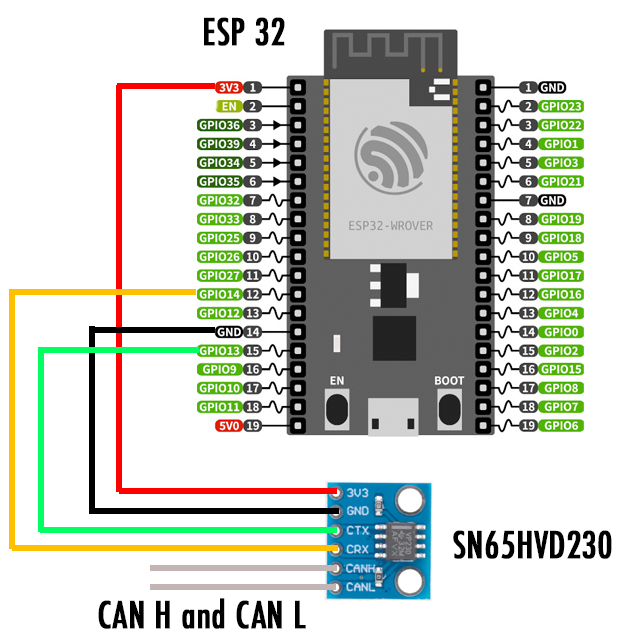
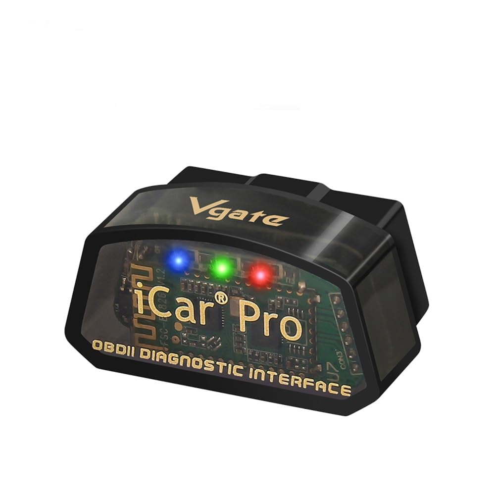

# OBD2
Library for ESP32 to read and write canbus packets over OBD2 connector directly or throught Elm327 bluetooth dongle.

***See it in action here: https://github.com/dixtone/GiuliaAndStelvioDPFMonitor***

## 1. Using direct connection
If you want to read/write directly over CAN-H and CAN-L, you need to use a canbus transceiver like **SN65HVD230** 




### Example of code

```c++

#define OBD2_DEBUG 1

#define CAN_TX_PIN  13
#define CAN_RX_PIN  14

#include "OBD2.h"

OBD2 obd2;

TaskHandle_t asyncTask;

//Eg.: we need to query ECU for Tire pressure.
//Service:22  PID:31D0 
//Value Formula: ((A*256)+B)/1000

//here we store value of the pid request
float tirePressure = 0.0;
float oilPressure = 0.0;

//or we can define a callback to manipulate response bytes
void ValueCallback(String PidName, uint8_t* responseBytes){
    //....
};

/*
OBD2Request is defined as follow:

struct OBD2Request {
  String Group; //name your pid groups
  String Name; //name your pid
  bool AlwaysSendHeader; //useful in cyclic request 
  long Header; //header or ecu-id
  uint8_t  Service; //service query
  uint16_t Pid; //pid to query
  uint8_t  ExpectedBytes; //how much bytes we waiting for?
  float  ScaleFactor; //scale factor
  float  AdjustFactor; //scalar value added or substracted for calculating value
  float  *BindValue; //direct bind value to a variable or property
  void (*ValueCallback)(String pid, uint8_t* responseBytes); //useful doing something when pid received
  long ReadInterval; //can be useful in cyclic request
  long ReadTime; //can be useful in cyclic request
};
*/

//then we define our request to query as formula
//Header or EcuID: DAC7F1 (become 0x18DAC7F1)
//Service:22  PID:31D0 
//Value Formula: ((A*256)+B)/1000

OBD2Request myRequest = {
     "Tires PIDS", "tireFronLeft", true, 0x18DAC7F1, 0x22, 0x31D0, 0x02, 0.001, 0, &tirePressure, &ValueCallback, 0
};


//define a Listener called every time we have a response:
void obd2Listener(OBD2Request* request, float value, uint8_t* responseBytes){

  Serial.print("Received message for "+request->Name+" :");
  Serial.println(value);
  Serial.println(); 
  for(int i=0;i<8;i++){
      Serial.print(responseBytes[i], HEX);
      Serial.print(" ");
  }
  Serial.println();
}


//run your code into task
void handleOBD2(void * parameter){
   
   OBD2Request* request;

   long sendTime = millis();
   int timeoutSend = 1000;
   OBD2StatusType status;
   OBD2BroadcastPacket bp;
   
   while(1){

      request = &myRequest;

      //handle broadcast packets if any
      bp = obd2.getBroadcastPacket();

      if(bp.Header>0x0)
      {
         //if we get this packetid, we can calculate engine oil pressure for example...
         //we don't need to query this, because it's broadcasted in CanBus
         if(bp.Header==0x4B2)
         {
            Serial.printf("\n>> Broadcast packet from ECU %04x : %02x %02x %02x %02x %02x %02x %02x %02x\n", bp.Header, bp.Byte0, bp.Byte1, bp.Byte2, bp.Byte3, bp.Byte4, bp.Byte5, bp.Byte6, bp.Byte7);

            //calculate oil pressure
            oilPressure = (float)( (( ((bp.Byte0<<(8))| bp.Byte1) & 0b0000000111111110) >> 1)/10.0 );
         }         
      }

      //every cycle we need to process requests
      status = obd2.process();
         
      if(status == OBD2StatusType::ready)
      {  
         //every second we send query request for tire pressure
         if(millis()-sendTime > timeoutSend)
         {  
            sendTime = millis();
            Serial.println("Send Request!");
            obd2.sendRequest(request);
         }         
      }
      else if(status == OBD2StatusType::timeout){
         
         Serial.printf("Service: %02x  Pid: %04x TIMEOUT\n",obd2.getResponseService(), obd2.getResponsePid());
         
      }
      else if(status == OBD2StatusType::nodata){
         Serial.printf("Service: %02x  Pid: %04x NODATA\n",obd2.getResponseService(), obd2.getResponsePid());
      }
      
     
      delay(10);
   }
}

void setup()
{
  Serial.begin(115200);

  //bit of power stabilization
  delay(3000);
  
  //create a task on core1
  xTaskCreatePinnedToCore( handleOBD2, "handleOBD2", 8096, NULL, 2, &asyncTask, 1); 

  //initilize canbus with speed of 500 kb/s
  obd2.Begin(CAN_TX_PIN, CAN_RX_PIN, 500E3);
  
  //setup listener callback
  obd2.onHandleValue(obd2Listener);

  //add broadcast filters for specific ecu id without querying 
  obd2.addBroadcastFilter(0x4B2); 

  //add filters for specific ecu id, here we need to query 
  obd2.addPacketFilter(0x18DAF110);
  obd2.addPacketFilter(0x18DAF1C7);
 
  Serial.println("[OK]");
  Serial.println("Ready!"); 

  delay(1000);  
}

void loop() {

   Serial.println("Loop...");

   Serial.printf("\n Oil pressure: %2.2f\n",oilPressure);

   delay(10);
}
```

## 2. Using bluetooth connection
Reading data throught OBD2 connector is possible using an OBD2 Bluetooth dongle like this:



**IT'S very important that your interface run original ELM 327 firmware and not clones, because they run slow and out of standards.. Vgate ICAr pro is the best choice for me.**

### Example of code

```c++

//debug:
#define OBD2_DEBUG 1

#include "BluetoothSerial.h"
#include "BTAddress.h"
#include "OBD2.h"

OBD2 obd2;

BluetoothSerial BluetoothConnector;

TaskHandle_t asyncTask;

bool appInitialized = false;

//Eg.: we need to query ECU for Tire pressure.
//Service:22  PID:31D0 
//Value Formula: ((A*256)+B)/1000

//here we store value of the pid request
float tirePressure = 0.0;

//or we can define a callback to manipulate response bytes
void ValueCallback(String PidName, uint8_t* responseBytes){
    //....
};

/*
OBD2Request is defined as follow:

struct OBD2Request {
  String Group; //name your pid groups
  String Name; //name your pid
  bool AlwaysSendHeader; //useful in cyclic request 
  long Header; //header or ecu-id
  uint8_t  Service; //service query
  uint16_t Pid; //pid to query
  uint8_t  ExpectedBytes; //how much bytes we waiting for?
  float  ScaleFactor; //scale factor
  float  AdjustFactor; //scalar value added or substracted for calculating value
  float  *BindValue; //direct bind value to a variable or property
  void (*ValueCallback)(String pid, uint8_t* responseBytes); //useful doing something when pid received
  long ReadInterval; //can be useful in cyclic request
  long ReadTime; //can be useful in cyclic request
};
*/

//then we define our request to query as formula
//Header or EcuID: DAC7F1 (become 0x18DAC7F1)
//Service:22  PID:31D0 
//Value Formula: ((A*256)+B)/1000

OBD2Request myRequest = {
     "Tires PIDS", "tireFronLeft", true, 0x18DAC7F1, 0x22, 0x31D0, 0x02, 0.001, 0, &tirePressure, &ValueCallback, 0
};


//define a Listener called every time we have a response:
void obd2Listener(OBD2Request* request, float value, uint8_t* responseBytes){

  Serial.print("Received message for "+request->Name+" :");
  Serial.println(value);
  Serial.println(); 
  for(int i=0;i<8;i++){
      Serial.print(responseBytes[i], HEX);
      Serial.print(" ");
  }
  Serial.println();
}


//run your code into task
void handleOBD2(void * parameter){
   
   OBD2Request* request;

   long sendTime = millis();
   int timeoutSend = 1000;
   OBD2StatusType status;
   OBD2BroadcastPacket bp;
   
   while(1){

      if(appInitialized)
      {
            //every cycle we need to process requests
            status = obd2.process();

            request = &myRequest;

            if(status == OBD2StatusType::ready)
            {  
                //every second we send query request for tire pressure
                if(millis()-sendTime > timeoutSend)
                {  
                    sendTime = millis();
                    Serial.println("Send Request!");
                    obd2.sendRequest(request);
                }         
            }
            else if(status == OBD2StatusType::timeout){
                
                Serial.printf("Service: %02x  Pid: %04x TIMEOUT\n",obd2.getResponseService(), obd2.getResponsePid());
                
            }
            else if(status == OBD2StatusType::nodata){
                Serial.printf("Service: %02x  Pid: %04x NODATA\n",obd2.getResponseService(), obd2.getResponsePid());
            }     
      }
           
      delay(10);
   }
}

void setup()
{
  Serial.begin(115200);

  //bit of power stabilization
  delay(3000);
  
  //create a task on core1
  xTaskCreatePinnedToCore( handleOBD2, "handleOBD2", 8096, NULL, 2, &asyncTask, 1); 

  //setup listener callback
  obd2.onHandleValue(obd2Listener);

  //add filters for specific ecu id, here we need to query 
  obd2.addPacketFilter(0x18DAF110);
  obd2.addPacketFilter(0x18DAF1C7);
 
  //initialize bluetooth connection over mac address
  uint8_t address[6] = {0x00, 0x00, 0x00, 0x00, 0x00, 0x00}; //replace with yours

  BluetoothConnector.begin("TESTConnectorBluetooth", true);
  bool connectionResult = BluetoothConnector.connect(address);

  if(connectionResult)
  {
    //then begin ELM comunication
    appInitialized = obd2.BeginElm327(BluetoothConnector, 2000); //2000 is timeout

    if(appInitialized)  
        Serial.println("OBD2 connection started");
    else
        Serial.println("Fail to connect"); 
  }
  else{
    Serial.println("Unable to connect over bluetooth!"); 
  }

  delay(1000);  
}

void loop() {

   Serial.println("Loop...");

   delay(10);
}
```
******************

My work is based over sandeepmistry CAN library:
https://github.com/sandeepmistry/arduino-CAN

****************** 

Code can be used as is: I do not provide any guarantee or responsibility in case of damage caused to your vehicle or person.

****************** 

If you appreciate my work, pay me a coffee: 

<a target="_blank" href="https://www.paypal.com/donate/?business=UPRH64ZWV5M4E&no_recurring=0&currency_code=EUR"></a>

****************** 
